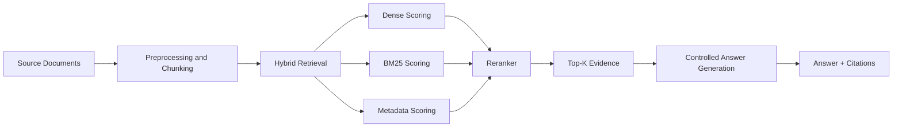

# LLM-Assisted RAG for Domain-Specific QA over Canadian Corporate Tax Fact Documents


## **Master, Data Science**

## **CSCI E-222 Foundations of Large Language Models — Final Project**

## Professor: Dmitry V. Kurochkin, PhD

Senior Research Analyst, Faculty of Arts and Sciences Office for Faculty Affairs, Harvard University

[Demo Video](#) · [Slides](#) · [Notebook / Main Entry Point](#) · [AWS Extension Notes](#)

## Author: **Dai-Phuong Ngo (Liam)**

## Youtube:


## Overview

This repository is the public project page for my CSCI E-222 final project. The project focuses on **retrieval-augmented question answering** over **Canadian corporate tax fact documents**. Instead of treating the LLM as a free-form chatbot, I designed the system to retrieve relevant evidence first, then generate grounded answers tied to that evidence. That design choice became the central theme of the project: in a specialized domain like corporate tax, retrieval quality, source control, and answer discipline matter more than surface fluency. The course requirements explicitly frame the final project as a **technology demonstration and tutorial**, not a research paper, and require a working LLM-based system, a reproducible workflow, a software demo, and at least one visualization.  

I developed the project iteratively from **v1** through **v5.2**, using smaller evaluation sets for fast iteration and a larger 50-question benchmark for the final consolidated version. I then extended the project to **AWS SageMaker AI Studio** and built a lightweight **Streamlit chatbot wrapper** as a deployment-oriented demo surface. The public repository is therefore both a final project write-up and a practical engineering record of how the system evolved from notebook experimentation into a more portable RAG workflow. 

---

# Executive Summary

This project answers a simple but important question:

> How can I build a domain-specific LLM workflow that answers Canadian corporate tax questions accurately, concisely, and with explicit source grounding?

The final system is a **hybrid RAG pipeline** that combines chunked document retrieval, dense embeddings, BM25-style lexical retrieval, reranking, and controlled answer generation. The reconstructed v5.2 artifact bundle shows a final configuration built around **BAAI/bge-small-en-v1.5** for embeddings, **cross-encoder/ms-marco-MiniLM-L-6-v2** for reranking, and **Qwen/Qwen2.5-1.5B-Instruct** for the local LLM path, with **2,016 chunks** and an embedding matrix of **(2016, 384)**. The same bundle reports strong 50-question benchmark results: **top-1 retrieval hit rate 0.98**, **top-k retrieval hit rate 1.00**, **baseline answer hit rate 0.30**, **final answer hit rate 1.00**, **citation hit rate 1.00**, **exact-mode rate 0.92**, and **verifier-supported rate 1.00**.  

Those results make the main conclusion very clear: by the time the project reached v5.2, the retrieval-and-grounding workflow was doing the real work. The system was no longer just “using an LLM.” It was using the LLM inside a constrained evidence pipeline that substantially outperformed a weaker baseline on the benchmark set. 

---

# Abstract

I built a domain-specific Retrieval-Augmented Generation system for question answering over Canadian corporate tax fact documents. The motivation for the project was practical: corporate tax information is document-heavy, terminology-heavy, and not well suited to unsupported free-form LLM responses. In that kind of environment, a generic answer that sounds plausible is often more dangerous than an answer that is slower but grounded.

The project evolved through several versions from **v1** to **v5.2**. Early versions established the basic ingestion and retrieval loop. Later versions improved chunking, metadata handling, ranking, reranking, answer control, and evaluation discipline. The final reconstructed v5.2 artifact summary shows a mature hybrid configuration with 2,016 chunks, a 384-dimensional embedding space and strong benchmark performance across retrieval, answer accuracy, and citation alignment. 

After completing the main Colab/Python workflow, I extended the project to **AWS SageMaker AI Studio**. The preflight stage successfully ported the v5.2 artifact-driven pipeline into AWS, loading the observed configuration, full chunk set, and embedding matrix. On a small CPU-only Studio instance, however, the full local Qwen path was too resource-constrained: the 3.09 GB weights file downloaded, but the process was killed during model loading. That result was still useful, because it showed that the workflow itself was portable, even though full local inference required stronger compute. I then built a lightweight Streamlit chatbot wrapper to make the retrieval-first pipeline easier to demo in an interface-oriented format.  

---

# Table of Contents

* [Problem Statement](#problem-statement)
* [Why This Project Matters](#why-this-project-matters)
* [Data Source and Scope](#data-source-and-scope)
* [System Architecture](#system-architecture)
* [Version History](#version-history)
* [Final v5.2 Configuration](#final-v52-configuration)
* [Experiments and Results](#experiments-and-results)
* [AWS Extension](#aws-extension)
* [Streamlit Chatbot Demo](#streamlit-chatbot-demo)
* [Implementation Details](#implementation-details)
* [How to Run](#how-to-run)
* [Discussion](#discussion)
* [Limitations and Responsible Use](#limitations-and-responsible-use)
* [Future Work](#future-work)

---

# Problem Statement

The problem I address in this project is **document-grounded domain-specific question answering**. More specifically, I wanted to answer corporate tax questions using a curated corpus of Canadian corporate tax fact documents, while minimizing unsupported answers and preserving explicit evidence support.

This project is not meant to be a generic assistant or an open-ended tax advisor. It is a **RAG system for focused, source-grounded QA**. That framing matches the course requirements very closely: the assignment explicitly identifies **document question answering with RAG** and **conversational agents** as valid LLM project types, and it requires a clear problem statement, a data source, an LLM-based solution, a working software demonstration, and a meaningful visualization.  

---

# Why This Project Matters

Large language models are strongest when they are integrated into workflows that control their knowledge boundaries. In a specialized document domain like tax, the primary challenge is not text generation by itself. The real challenge is selecting the right evidence, suppressing hallucinations, and producing concise answers that can be traced back to source material.

That is why I chose a **retrieval-first design**. By forcing the system to retrieve supporting evidence before answering, I made the project less about unconstrained generation and more about practical information access. In other words, I treated the LLM as one component in a controlled reasoning-and-evidence workflow.

---

# Data Source and Scope

The system was built for **Canadian corporate tax fact documents** used as the authoritative retrieval corpus for the project. In the working project, those documents were used for chunk creation, indexing, retrieval, reranking, answer support, and evaluation. In the public repository, I focus on the **method, code structure, reconstructed artifacts, AWS extension scripts, and demo interface**, rather than redistributing the full source document set.

This design choice is intentional and aligned with the project requirements. The course requires a usable data source and reproducible instructions, but it also explicitly notes that full datasets larger than 10 MB should not simply be uploaded when links and instructions are more appropriate. It also emphasizes public-shareable code and materials. In that context, the repository is structured as a reusable engineering artifact rather than as a direct content redistribution package. 

---

# System Architecture

The final project follows a staged RAG architecture:



The core idea is simple:

1. preprocess and chunk the document corpus,
2. retrieve candidate chunks using multiple signals,
3. rerank the candidates,
4. build the answer from the selected evidence,
5. keep the answer tied to source support.

By v5.2, the system had become much more than a basic “retrieve text and ask a model” loop. It had become a retrieval pipeline with deliberate weighting, chunk typing, reranking, and benchmark-driven validation. The v5.2 artifact bundle confirms that the final hybrid system combined dense, BM25, metadata, and reranker signals rather than relying on a single retrieval strategy. 

---

# Version History

## v1 — First end-to-end proof of concept

Version 1 established the basic workflow: ingest documents, chunk the corpus, retrieve candidate evidence, and generate an answer. At this stage, the project was proving feasibility rather than performance. The system could answer questions, but retrieval quality and answer control were still rough.

## v2 — Retrieval cleanup and better evidence targeting

Version 2 improved the retrieval behavior and reduced obvious mismatch between the retrieved evidence and the final answer. This stage helped me identify that in this project, answer quality would depend heavily on chunk quality and ranking quality.

## v4 — Structural improvements and better grounding

Version 4 represented a more mature architectural stage. I paid more attention to chunk types, metadata, and evidence formatting so the system could retrieve not just text, but **useful answerable units**.

## v5 — Stronger ranking and answer discipline

Version 5 moved the project closer to a production-style RAG workflow. Retrieval, reranking, and answer generation were treated as connected components, not isolated steps.

## v5.1 — Broader benchmark testing

Version 5.1 expanded beyond smaller 20-question testing into a 50-question benchmark view. This was important because a system that looks good on a tiny set can still be fragile. The broader evaluation helped validate whether the improvements generalized.

## v5.2 — Final consolidated system

Version 5.2 became the final release candidate. It integrated hybrid retrieval, reranking, controlled answering, and stronger evaluation support into the most stable form of the project.

---

# Final v5.2 Configuration

The reconstructed v5.2 artifact bundle reports the following observed configuration:

* **Embedding model:** `BAAI/bge-small-en-v1.5`
* **Reranker:** `cross-encoder/ms-marco-MiniLM-L-6-v2`
* **LLM:** `Qwen/Qwen2.5-1.5B-Instruct`
* **4-bit loading:** enabled in the original observed configuration
* **Dense weight:** `0.44`
* **BM25 weight:** `0.18`
* **Metadata weight:** `0.23`
* **Rerank weight:** `0.15`
* **Dense top-k:** `28`
* **BM25 top-k:** `28`
* **Rerank top-k:** `14`
* **Final top-k:** `6`
* **Number of chunks:** `2016`
* **Embedding matrix shape:** `(2016, 384)` 

The chunk-type distribution was:

* **heading:** 46
* **text:** 112
* **table:** 243
* **row:** 1615 

This breakdown is one of the most important technical details in the final project. It reflects a document representation strategy that distinguishes between headings, running text, tables, and row-level units instead of flattening the corpus into generic paragraphs.

---

# Experiments and Results

## Quantitative Results

The final reconstructed v5.2 summary reports the following 50-question benchmark results:

* **Questions evaluated:** 50
* **Top-1 retrieval hit rate:** 0.98
* **Top-k retrieval hit rate:** 1.00
* **Baseline answer hit rate:** 0.30
* **Final answer hit rate:** 1.00
* **Citation hit rate:** 1.00
* **Exact-mode rate:** 0.92
* **Verifier-supported rate:** 1.00 

## Result Interpretation

These results tell a very strong story.

The final retrieval system was extremely reliable on the benchmark. A **top-1 retrieval hit rate of 0.98** means that almost every question had the correct evidence at rank 1, and a **top-k retrieval hit rate of 1.00** means the correct evidence was always present somewhere in the retrieved set. That indicates that by v5.2, the retrieval side of the system had reached a very mature state. 

The difference between the **baseline answer hit rate (0.30)** and the **final answer hit rate (1.00)** shows the actual value of the full RAG architecture. This was not a small incremental improvement. It was a major shift from a weak baseline to a highly effective retrieval-grounded answer pipeline on the benchmark. The **citation hit rate of 1.00** and **verifier-supported rate of 1.00** further support the claim that the final system was not simply answering correctly by chance, but doing so with source support. 

## Visualization

The course requires at least one meaningful visualization, such as metric comparisons, qualitative comparisons, or embedding/structure visualizations. 

The most effective visualization for this project is a **version comparison chart** that shows how answer quality and retrieval quality improved over time. The chart I recommend for this repository is a grouped bar chart comparing:

* baseline answer hit rate,
* final answer hit rate,
* citation hit rate,
* and exact-mode rate.

A second strong visualization is a **qualitative side-by-side comparison** showing:

* a question,
* the retrieved chunks,
* the final answer,
* and the citation support.

Add both to the README if possible.

---

# AWS Extension

After finishing the main Colab/Python workflow, I extended the project to **AWS SageMaker AI Studio** as an additional engineering and deployment exercise.

The most important AWS success was the **preflight** stage. In SageMaker Studio, the patched v5.2 workflow successfully:

* extracted the artifact bundle,
* loaded the observed run configuration,
* loaded all **2,016 chunks**,
* loaded the **(2016, 384)** embedding matrix,
* and reproduced the stored evaluation summary.  

That result matters because it proves that the pipeline was not dependent on Colab alone. The system’s artifact-driven design was portable enough to run in a managed AWS notebook environment.

At the same time, AWS exposed a real compute limitation. On a small CPU-backed SageMaker space, the full local Qwen path downloaded the **3.09 GB** `model.safetensors` file and then the process was killed during model loading. That means the workflow itself was portable, but the local inference configuration required stronger resources than the smallest Studio runtime could provide. This was a valuable engineering lesson, not a failure of the project. It showed the difference between **workflow portability** and **resource adequacy**. 

---

# Streamlit Chatbot Demo


As a deployment-oriented extension, I wrapped the reconstructed v5.2 backend in a lightweight **Streamlit chatbot application**. The app bundle included:

* `app.py`
* `rag_core.py`
* `kpmg_tax_rag_v52_aws.py`
* `Dockerfile`
* `requirements.app.txt`
* deployment templates for an App Runner-style path. 

The purpose of the chatbot wrapper was not to reproduce the heaviest full local model pipeline on a modest Studio instance. Instead, it was to provide a **lightweight web-facing demo** for the retrieval-first workflow. During that process, I had to solve several practical engineering issues:

* folder and runtime path assumptions,
* a `pandas` / `streamlit` version conflict,
* and a SageMaker-specific permission issue caused by the default `BASE_DIR` path falling back to `"/app"`. The corresponding Streamlit traceback clearly shows the `PermissionError` on `'/app'` and the line in `rag_core.py` where that path was being created.  

This extension mattered because it translated the project from “a working notebook pipeline” into “a lightweight application surface.” Even though the backend remained the real core of the project, the Streamlit wrapper made the system easier to present, test, and reason about as a user-facing demo.

---

# Implementation Details

The project was built in Python and uses the kind of modern LLM tooling the course explicitly calls for: standard deep learning libraries, Hugging Face model tooling, and reproducible scripts/notebooks. The assignment also requires a **single coherent working demo**, clear run instructions, organized code, and reproducible setup details. This repository is structured around that expectation.  

The implementation now exists in three related layers:

## 1. Core notebook / Python workflow

This is the original experimental and evaluation environment, developed primarily in notebook/Python form.

## 2. AWS portability layer

This layer includes patched scripts and AWS-oriented runtime configuration so the artifact workflow can be tested in SageMaker Studio.

## 3. Demo layer

This layer includes the Streamlit wrapper and deployment-oriented files for a more application-like presentation of the retrieval-first QA system.

---

# Repository Structure

```text
.
├── notebooks/                    # original or reconstructed notebook workflows
├── src/                          # reusable Python modules
├── aws/                          # SageMaker / EC2 / cloud helper scripts
├── app_runner_tax_chatbot/       # lightweight Streamlit chatbot wrapper
├── artifacts/                    # local artifact bundles (not all may be public)
├── outputs/                      # evaluation summaries / charts / screenshots
├── README.md
└── requirements*.txt
```

Update this tree to match your final repo layout.

---

# How to Run

## Colab / local notebook path

1. Install dependencies.
2. Load the corpus or artifact bundle.
3. Build or load the retrieval index.
4. Run the question-answering cells or script.
5. Execute evaluation on the benchmark set.

## SageMaker AI Studio path

1. Create the SageMaker domain and JupyterLab space.
2. Upload the patched bundle and v5.2 artifact bundle.
3. Run the preflight step.
4. For lightweight tests, use CPU-friendly configuration.
5. For full local model loading, use stronger compute.
6. Stop the JupyterLab app when finished to avoid unnecessary charges.

## Streamlit chatbot path

1. Create a Python environment.
2. Install the CPU-friendly dependency set.
3. Set a writable runtime path and artifact path.
4. Launch Streamlit.
5. Access the app through the SageMaker Studio proxy URL.

---

# Discussion

## What worked well

The biggest success in this project was the decision to treat retrieval as the core of the system. By v5.2, the project had become far more than “an LLM that answers tax questions.” It had become a retrieval-centered QA workflow with measurable performance gains, explicit citations, and benchmark validation. The final metrics strongly support that conclusion. 

The second major success was the artifact-driven design. That design made it possible to move the system into SageMaker Studio, reproduce the observed configuration, and validate the backend logic without having to fully reconstruct every historical step from scratch. 

## What was difficult

The biggest technical challenge was the gap between **model logic** and **runtime reality**. A system can be algorithmically strong and still fail under small-instance constraints. The SageMaker test made that extremely clear when the local Qwen path was killed on a modest CPU-backed environment after downloading multi-gigabyte weights. 

The second challenge was deployment engineering. The Streamlit extension surfaced very practical issues:

* missing files because of working-directory mistakes,
* package-resolution conflicts such as `streamlit` vs `pandas==3.0.2`,
* and environment-specific path assumptions like the `"/app"` base directory.  

## Lessons learned

This project taught me that high-quality domain QA depends on:

* document representation,
* retrieval strategy,
* reranking quality,
* and answer control.

It also taught me that deployment is not just an afterthought. Once a model or workflow leaves the notebook environment, issues like paths, permissions, dependency pins, runtime memory, and storage become central engineering concerns.

---

# Limitations and Responsible Use

This system is a **document-grounded domain QA assistant**, not a substitute for professional tax advice.

Its main limitations are:

* benchmark dependence,
* scope dependence on the indexed documents,
* and runtime dependence for heavier local inference stages.

A strong result on a 50-question benchmark is meaningful, but it is still not the same thing as proving universal robustness across all real-world tax questions. The system is strongest when the question is well scoped and the answer can be grounded directly in the indexed material. It is weaker for highly personalized, fact-dependent, or out-of-scope advisory questions.

The course requirements explicitly ask for a reflection on limitations, risks, and responsible use, including concerns such as hallucination and misuse. In this project, responsible use means:

* keeping source grounding visible,
* avoiding overclaiming,
* not presenting the system as tax advice,
* and clearly marking the boundary between retrieved evidence and model-generated language. 

---

# Future Work

The next improvements I would prioritize are:

* a broader benchmark with more error categories,
* stronger qualitative evaluation examples,
* more polished citation display,
* a cleaner distinction between lightweight retrieval-only demos and full local inference paths
* and a more stable cloud deployment path for the chatbot demo.

From a product perspective, the most natural next step would be a more production-oriented service layer around the retrieval-first backend. From a research perspective, the next useful step would be deeper error analysis by question type and chunk type.


