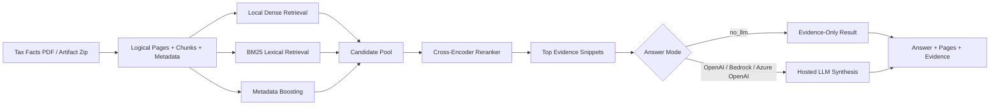

# **LLM-Assisted Source-Grounded RAG for Domain-Specific QA over Canadian Corporate Tax Fact Documents using Google Colab v1-v5.2, AWS SageMaker / Bedrock / OpenAI, and Azure Foundry AI / Azure OpenAI / Docker / Azure Container Apps**


---

<a id="toc-author-and-course-context"></a>
## Author and course context

**Developer:** Dai-Phuong Ngo (Liam)  
**Course:** CSCI E-222 Foundations of Large Language Models  
**Academic Term:** Spring 2026
**Program:** Master of Liberal Arts in Extension Studies, Data Science  
**Institution:** Harvard Extension School, Harvard University  
**Professor:** Dmitry V. Kurochkin, PhD  

---

<a id="toc-project-links"></a>
## Project links

| Item | Link |
|---|---|
| GitHub repository | https://github.com/daiphuongngo/LLM-Assisted-RAG-for-Canadian-Corporate-Tax-Fact-AWS-SageMaker-Bedrock-Azure-Foundry-AI-OpenAI |
| Streamlit demo | https://taxrag-streamlit.icyforest-f8f8706c.eastus.azurecontainerapps.io |
| YouTube demo | https://www.youtube.com/watch?v=0XbW2nOOz7g |
| Public data source | KPMG Canada Tax Facts 2025-2026: https://kpmg.com/ca/en/services/tax/tax-facts.html |

---

<a id="table-of-contents"></a>
## Table of contents

Click any section title below to jump directly to that part of the README.

- [Project links](#toc-project-links)
- [Author and course context](#toc-author-and-course-context)
- [Executive summary](#toc-executive-summary)
- [Why this matters for Corporate Tax Advisory](#toc-why-this-matters-for-corporate-tax-advisory)
- [Problem statement](#toc-problem-statement)
- [Data source and artifact](#toc-data-source-and-artifact)
  - [Preserved artifact properties](#toc-preserved-artifact-properties)
  - [Data-source caution](#toc-data-source-caution)
- [Data challenge: tax facts are structured data inside documents](#toc-data-challenge-tax-facts-are-structured-data-inside-documents)
- [High-level architecture](#toc-high-level-architecture)
- [Whole pipeline evolution](#toc-whole-pipeline-evolution)
  - [Phase 1 — Google Colab no-LLM / local retrieval engineering](#toc-phase-1-google-colab-no-llm-local-retrieval-engineering)
  - [Phase 2 — AWS SageMaker Streamlit hosted modes](#toc-phase-2-aws-sagemaker-streamlit-hosted-modes)
  - [Phase 3 — Azure Foundry AI + Docker + Azure Container Apps](#toc-phase-3-azure-foundry-ai-plus-docker-plus-azure-container-apps)
- [Supported runtime modes](#toc-supported-runtime-modes)
  - [AWS modes](#toc-aws-modes)
  - [Azure modes](#toc-azure-modes)
- [Technologies used](#toc-technologies-used)
  - [Core RAG / ML technologies](#toc-core-rag-ml-technologies)
  - [AWS technologies](#toc-aws-technologies)
  - [Azure technologies](#toc-azure-technologies)
- [Techniques used](#toc-techniques-used)
- [Repository layout](#toc-repository-layout)
- [Setup: common environment variables](#toc-setup-common-environment-variables)
- [Run on AWS SageMaker Studio / JupyterLab](#toc-run-on-aws-sagemaker-studio-jupyterlab)
  - [1. Create and activate a Python environment](#toc-1-create-and-activate-a-python-environment)
  - [2. Set AWS paths](#toc-2-set-aws-paths)
  - [3. Run no-LLM evidence baseline](#toc-3-run-no-llm-evidence-baseline)
  - [4. Run AWS OpenAI mode](#toc-4-run-aws-openai-mode)
  - [5. Run AWS Bedrock mode](#toc-5-run-aws-bedrock-mode)
  - [6. Compare AWS benchmark runs](#toc-6-compare-aws-benchmark-runs)
  - [7. Run AWS Streamlit app](#toc-7-run-aws-streamlit-app)
- [Run on Azure Foundry AI / Azure OpenAI](#toc-run-on-azure-foundry-ai-azure-openai)
  - [1. Prepare workspace](#toc-1-prepare-workspace)
  - [2. Install dependencies](#toc-2-install-dependencies)
  - [3. Set environment variables](#toc-3-set-environment-variables)
  - [4. Test Azure OpenAI directly](#toc-4-test-azure-openai-directly)
  - [5. Run smoke tests](#toc-5-run-smoke-tests)
  - [6. Run Azure no-LLM and Azure OpenAI benchmark](#toc-6-run-azure-no-llm-and-azure-openai-benchmark)
  - [7. Run Azure Streamlit locally](#toc-7-run-azure-streamlit-locally)
- [Deploy Azure Streamlit app to Azure Container Apps](#toc-deploy-azure-streamlit-app-to-azure-container-apps)
- [Evaluation](#toc-evaluation)
  - [Preserved v5.2 benchmark](#toc-preserved-v5-2-benchmark)
  - [Revised cloud benchmark](#toc-revised-cloud-benchmark)
  - [Recommended evaluation dimensions](#toc-recommended-evaluation-dimensions)
- [Q6 intentional trap / negative-control test](#toc-q6-intentional-trap-negative-control-test)
  - [Trap design](#toc-trap-design)
  - [What happened](#toc-what-happened)
  - [Why this matters](#toc-why-this-matters)
- [Cost model: tokens, not PDF pages](#toc-cost-model-tokens-not-pdf-pages)
  - [Answer-time cost formula](#toc-answer-time-cost-formula)
  - [What counts as input tokens?](#toc-what-counts-as-input-tokens)
  - [What counts as output tokens?](#toc-what-counts-as-output-tokens)
  - [What is not token-billed as an LLM call in this prototype?](#toc-what-is-not-token-billed-as-an-llm-call-in-this-prototype)
  - [Production measurement plan](#toc-production-measurement-plan)
- [Streamlit demo flow](#toc-streamlit-demo-flow)
- [Safety and responsible-use controls](#toc-safety-and-responsible-use-controls)
- [Production-readiness status](#toc-production-readiness-status)
  - [Present in prototype](#toc-present-in-prototype)
  - [Missing for production](#toc-missing-for-production)
- [Future production path for Corporate Tax Act Advisory RAG](#toc-future-production-path-for-corporate-tax-act-advisory-rag)
- [Troubleshooting](#toc-troubleshooting)
  - [The app says the artifact cannot be found](#toc-the-app-says-the-artifact-cannot-be-found)
  - [Azure OpenAI direct call fails](#toc-azure-openai-direct-call-fails)
  - [Streamlit works locally but not in Azure Container Apps](#toc-streamlit-works-locally-but-not-in-azure-container-apps)
  - [Bedrock mode returns access denied](#toc-bedrock-mode-returns-access-denied)
  - [Exact score is low even though answer looks correct](#toc-exact-score-is-low-even-though-answer-looks-correct)
- [Project achievements](#toc-project-achievements)
- [License and use](#toc-license-and-use)

---

<a id="toc-executive-summary"></a>
## Executive summary

This project answers a practical question:

> How can I build a domain-specific LLM workflow that answers Canadian corporate tax-fact questions accurately, concisely, and with visible source grounding?

The system follows one core design principle:

```text
Retrieval first, LLM second.
```

Instead of asking a general chatbot to answer tax questions from memory, the system:

1. loads a prepared v5.2 tax RAG artifact,
2. retrieves relevant chunks from the artifact,
3. reranks and selects evidence,
4. optionally sends only the selected evidence to a hosted LLM,
5. returns a concise answer with cited pages and visible evidence.

The final project compares a retrieval-only evidence baseline with hosted LLM answer generation across AWS and Azure:

- **Google Colab v1-v5.2:** no-LLM / local retrieval engineering, chunking, metadata, reranking, and benchmarking.
- **AWS SageMaker Streamlit:** `no_llm`, `openai`, and `bedrock` modes over the same v5.2 evidence artifact.
- **Azure Foundry AI / Azure OpenAI:** `no_llm` and `azure_openai` modes in a Streamlit app.
- **Azure deployment:** Docker + Azure Container Registry + Azure Container Apps for a stable HTTPS demo.

The key result is that the retrieval layer became the strongest part of the system. The preserved v5.2 artifact achieved:

| Metric | Result |
|---|---:|
| Top-k retrieval hit rate | 1.00 |
| Top-1 retrieval hit rate | 0.98 |
| Final answer hit rate | 1.00 |
| Citation hit rate | 1.00 |
| Exact-mode rate | 0.92 |
| Verifier-supported rate | 1.00 |

The current cloud benchmark shows that the system consistently finds the correct evidence pages across no-LLM, AWS OpenAI, AWS Bedrock, and Azure OpenAI modes. Hosted LLMs improve answer synthesis, but only because the retrieval layer first selects the relevant source evidence.

---

<a id="toc-why-this-matters-for-corporate-tax-advisory"></a>
## Why this matters for Corporate Tax Advisory

Tax-advisory work depends on facts that are often buried in PDFs, tables, footnotes, jurisdiction rows, dates, thresholds, and narrow exceptions. A fluent model can still be wrong if it selects the wrong province, year, table row, threshold, rate, or numbered note.

This project is designed around a practical advisory workflow:

```text
Ask a tax-fact question
        ↓
Retrieve the likely source page / table row / note
        ↓
Show the retrieved evidence
        ↓
Optionally summarize with a hosted LLM
        ↓
Advisor reviews the source and final wording
```

The advisory value is not:

```text
AI replaces tax research.
```

The advisory value is:

```text
AI gets the team to the right source faster, while keeping evidence visible for review.
```

For an Corporate Tax Act Advisory LLM + RAG project, the same architecture can be adapted to approved internal knowledge sources, such as curated legislation excerpts, technical guidance, checklists, interpretation notes, rate tables, and internal research memos, assuming proper access control, data-governance review, and human validation.

---

<a id="toc-problem-statement"></a>
## Problem statement

This project addresses the task:

> Given a Canadian corporate tax-fact question, retrieve the relevant source evidence and generate a concise, source-grounded answer only from that evidence.

The system is **not** a general tax-advice engine. It is a research-assistance prototype that answers focused fact questions from an indexed source corpus.

Good target questions include:

```text
What is the threshold for a general corporation in Alberta?
What is the 2025 Federal Part VI tax rate?
What is the R&D ITC rate?
What are the filing and payment deadlines for a corporate tax return?
What are the notes for R&D investment tax credits?
```

Poor target questions include:

```text
Should my company take this tax position?
How should a client restructure its transactions?
What is the best tax plan for a specific fact pattern?
```

Those advisory questions require professional judgment, client-specific facts, and human review. This prototype supports source lookup and summarization only.

---

<a id="toc-data-source-and-artifact"></a>
## Data source and artifact

The public source used for the project is:

```text
KPMG Canada Tax Facts 2025-2026
https://kpmg.com/ca/en/services/tax/tax-facts.html
```

The prepared artifact used by the cloud code is expected to be named something like:

```text
kpmg_tax_rag_outputs_v52_corporate_50q-20260404T200240Z-1-001.zip
```

If the local artifact has a different timestamp, set the environment variable to the exact file path:

```bash
export ARTIFACT_ZIP="$BASE_DIR/kpmg_tax_rag_outputs_v52_corporate_50q-20260404T190302Z-1-001.zip"
```

<a id="toc-preserved-artifact-properties"></a>
### Preserved artifact properties

| Artifact property | Observed value |
|---|---:|
| Chunks | 2,016 |
| Embedding dimension | 384 |
| Embedding model | `BAAI/bge-small-en-v1.5` |
| Reranker | `cross-encoder/ms-marco-MiniLM-L-6-v2` |
| Local v5.2 answer path | `Qwen/Qwen2.5-1.5B-Instruct` |
| AWS hosted answer paths | OpenAI and Amazon Bedrock Nova Micro |
| Current Azure hosted answer path | Azure OpenAI GPT-4.1 through Azure Foundry AI |
| UI | Streamlit |
| Azure packaging | Docker image deployed to Azure Container Apps |

<a id="toc-data-source-caution"></a>
### Data-source caution

Do **not** commit proprietary, confidential, client-specific, internal-only, or secret-bearing documents to GitHub. This public repository should contain code, sample instructions, screenshots, and small non-sensitive artifacts only.

---

<a id="toc-data-challenge-tax-facts-are-structured-data-inside-documents"></a>
## Data challenge: tax facts are structured data inside documents

A tax fact PDF is not just a sequence of paragraphs. Many correct answers live inside:

- tables,
- row-level values,
- footnotes,
- numbered notes,
- jurisdiction-specific rows,
- filing deadlines,
- effective dates,
- exceptions and temporary relief language.

A simple chunking strategy can retrieve the correct page but still lose the exact row or note. For this reason, the preprocessing step preserves:

- printed page numbers,
- section titles,
- content type,
- table context,
- row context,
- note metadata,
- candidate value strings.

This is why the project is retrieval-first. The LLM is useful only after the source structure has been preserved well enough for retrieval and review.

---

<a id="toc-high-level-architecture"></a>
## High-level architecture



At answer time, the model does **not** read the whole PDF directly. It receives:

- system instructions,
- user question,
- selected evidence chunks,
- snippet text,
- metadata,
- citations / page references,
- optionally prior chat context.

This means answer-time LLM cost is based on selected prompt tokens and output tokens, not the full PDF page count.

---

<a id="toc-whole-pipeline-evolution"></a>
## Whole pipeline evolution

The project evolved in three major phases.

<a id="toc-phase-1-google-colab-no-llm-local-retrieval-engineering"></a>
### Phase 1 — Google Colab no-LLM / local retrieval engineering

| Stage | Focus | Main lesson |
|---|---|---|
| Colab v1-v2 | PDF parsing, early chunks, baseline retrieval | Flat chunks lose table and note context. |
| Colab v3-v4 | Evaluation expansion and layout-aware RAG | Page, section, and row metadata matter. |
| Colab v5-v5.2 | Best retrieval artifact | Hybrid retrieval + metadata scoring + reranking improved grounding. |

<a id="toc-phase-2-aws-sagemaker-streamlit-hosted-modes"></a>
### Phase 2 — AWS SageMaker Streamlit hosted modes

| Mode | Role |
|---|---|
| `no_llm` | Evidence-only baseline; confirms whether retrieval finds the right page before synthesis. |
| `openai` | Hosted answer synthesis over the same selected evidence. |
| `bedrock` | AWS-native hosted model path using Amazon Bedrock Nova Micro / Converse API. |

The AWS phase showed that the same evidence artifact could run in SageMaker and support multiple answer-generation modes. It also showed why hosted LLMs are practical: local Qwen loading was too heavy for a small CPU-only Studio space, while hosted generation avoided local model loading.

<a id="toc-phase-3-azure-foundry-ai-plus-docker-plus-azure-container-apps"></a>
### Phase 3 — Azure Foundry AI + Docker + Azure Container Apps

| Component | Role |
|---|---|
| Azure Foundry AI / Azure OpenAI | GPT-4.1 hosted answer generation. |
| Streamlit | User interface for no-LLM and Azure OpenAI modes. |
| Docker | Packages app code, dependencies, startup command, and artifact path. |
| Azure Container Registry | Builds and stores the container image. |
| Azure Container Apps | Provides stable HTTPS deployment for the Streamlit app. |

The Azure version moved the demo beyond temporary notebook or Cloud Shell preview URLs and into a stable containerized web app.

---

<a id="toc-supported-runtime-modes"></a>
## Supported runtime modes

<a id="toc-aws-modes"></a>
### AWS modes

| Mode | Backend | What it does | Requires cloud key / permission? |
|---|---|---|---|
| `no_llm` | Retrieval-only baseline | Retrieves evidence and returns safe baseline/evidence output. | No |
| `openai` | OpenAI API from AWS/SageMaker runtime | Uses retrieved evidence and calls OpenAI for final answer generation. | Yes, `OPENAI_API_KEY` |
| `bedrock` | Amazon Bedrock Runtime Converse API | Uses retrieved evidence and calls a Bedrock model such as Amazon Nova. | Yes, IAM permission for Bedrock |

<a id="toc-azure-modes"></a>
### Azure modes

| Mode | Backend | What it does | Requires cloud key / permission? |
|---|---|---|---|
| `no_llm` | Retrieval-only baseline | Retrieves evidence and returns safe baseline/evidence output. | No |
| `azure_openai` | Azure OpenAI through Azure Foundry AI | Uses retrieved evidence and calls an Azure OpenAI deployment for final answer generation. | Yes, Azure endpoint/key/deployment |

---

<a id="toc-technologies-used"></a>
## Technologies used

<a id="toc-core-rag-ml-technologies"></a>
### Core RAG / ML technologies

| Technology | Role |
|---|---|
| Python | Main implementation language. |
| Streamlit | Interactive demo UI. |
| NumPy | Loads local embedding matrix such as `chunk_embeddings.npy`. |
| pandas | Benchmark result analysis and comparison. |
| scikit-learn / SciPy | Similarity, metrics, and numerical utilities. |
| sentence-transformers | Local embedding and reranking model support. |
| Hugging Face Transformers | Supports original local model pipeline and embedding/reranker tooling. |
| `BAAI/bge-small-en-v1.5` | Local dense embedding model used in the v5.2 artifact. |
| BM25 | Lexical retrieval component. |
| `cross-encoder/ms-marco-MiniLM-L-6-v2` | Local reranker used to improve final evidence ordering. |
| JSON / JSONL | Stores logical pages, chunks, benchmark artifacts, logs, and model results. |

<a id="toc-aws-technologies"></a>
### AWS technologies

| AWS technology | Used? | Role |
|---|---:|---|
| Amazon SageMaker Studio / JupyterLab | Yes | AWS development and demo environment. |
| SageMaker Studio proxy | Yes | Used to open Streamlit from JupyterLab. |
| Amazon Bedrock | Yes | Hosted LLM backend for AWS `bedrock` mode. |
| Bedrock Converse API | Yes | Sends system/user messages and retrieved evidence to Bedrock. |
| Amazon Nova Micro / Lite | Yes | Example AWS-native hosted model path. |
| boto3 / botocore | Yes | AWS SDK support for Bedrock and optional S3 helpers. |
| IAM execution role | Yes | SageMaker role must be able to invoke Bedrock. |
| Amazon S3 | Optional | Local artifact zip is enough for demo; code can support cloud sync. |

<a id="toc-azure-technologies"></a>
### Azure technologies

| Azure technology | Used? | Role |
|---|---:|---|
| Azure Foundry AI / Azure OpenAI | Yes | Hosted LLM backend for `azure_openai` mode. |
| Azure OpenAI GPT-4.1 deployment | Yes | Final Azure answer-generation model. |
| OpenAI Python SDK against Azure endpoint | Yes | Calls Azure OpenAI using endpoint/deployment values. |
| Docker | Yes | Packages the Azure Streamlit app. |
| Azure Container Registry | Yes | Builds and stores the container image. |
| Azure Container Apps | Yes | Hosts Streamlit as a stable web app. |
| Azure CLI | Yes | Deploy, update, log, and cleanup scripts. |
| Azure Container Apps secrets | Yes | Stores runtime secrets such as Azure OpenAI key. |
| Azure AI Search | No | Recommended future improvement. |
| Azure Blob Storage | No | Recommended future improvement for larger/durable artifacts. |
| Azure Key Vault | No | Recommended future improvement for production secrets. |
| Entra ID / app RBAC | No | Recommended future improvement for internal deployment. |
| App Insights / full monitoring | No | Recommended future improvement. |

---

<a id="toc-techniques-used"></a>
## Techniques used

| Technique | Description |
|---|---|
| Retrieval-Augmented Generation | Retrieve source evidence first, then generate an answer from that evidence. |
| Local vector retrieval | Uses precomputed local embedding vectors rather than a managed vector database. |
| Hybrid retrieval | Combines dense retrieval, BM25 lexical retrieval, and metadata boosts. |
| Page-aware chunking | Preserves printed page numbers and logical page metadata. |
| Table-aware chunking | Preserves table and row-level context for rate/threshold questions. |
| Note-aware preprocessing | Keeps note context for long-form note questions. |
| Metadata boosting | Uses page, section, topic, and answer-type metadata to improve ranking. |
| Cross-encoder reranking | Reranks candidate evidence before final evidence selection. |
| Evidence-only baseline | `no_llm` mode validates retrieval without relying on answer generation. |
| Hosted LLM generation | OpenAI, Bedrock, and Azure OpenAI synthesize answers from selected evidence. |
| Prompt engineering | Prompts instruct the model to answer only from retrieved evidence. |
| JSON-constrained output | Model output is expected to include answer, confidence, cited pages, and reasoning. |
| Deterministic generation | Hosted LLM calls use low/zero temperature for more reproducible answers. |
| Citation grounding | Answers are expected to cite or display retrieved source pages. |
| Negative-control evaluation | Q6 intentionally used a wrong expected answer to test evidence-following behavior. |
| Benchmark comparison | Compares no-LLM, OpenAI, Bedrock, and Azure OpenAI modes. |
| Cost tracking | Uses per-call token and latency logging where available. |
| Safety guardrails | Prompts require evidence-only answers and abstention when evidence is insufficient. |

---

<a id="toc-repository-layout"></a>
## Repository layout

```text
.
├── README.md
├── requirements_aws_v52.txt
├── requirements_azure_foundry.txt
│
├── aws/
│   ├── kpmg_tax_rag_v52_aws.py
│   ├── hosted_llm_generators.py
│   ├── taxfact_retrieval_utils.py
│   ├── run_taxfact_benchmark_v4.py
│   ├── compare_taxfact_runs_v2.py
│   ├── streamlit_taxfact_app_v2.py
│   └── taxfact_questions_v3.json
│
├── azure/
│   ├── Dockerfile
│   ├── startup_aca.sh
│   ├── requirements_azure_foundry.txt
│   ├── app/
│   │   ├── azure_hosted_llm_generators.py
│   │   ├── kpmg_tax_rag_v52_aws.py
│   │   ├── tax_rag_v52_core.py
│   │   ├── taxfact_retrieval_utils.py
│   │   ├── preflight_azure_taxrag.py
│   │   ├── run_taxfact_benchmark_azure.py
│   │   ├── compare_taxfact_runs_v2.py
│   │   ├── streamlit_taxfact_app_azure.py
│   │   ├── test_azure_openai_direct.py
│   │   └── taxfact_questions_v3.json
│   └── scripts/
│       ├── 01_setup_environment.sh
│       ├── 02_export_env_template.sh
│       ├── 03_run_smoke_tests.sh
│       ├── 04_run_full_benchmark.sh
│       ├── 05_run_streamlit.sh
│       ├── 06_deploy_aca.sh
│       ├── 07_update_aca_image.sh
│       ├── 08_aca_logs.sh
│       └── 09_aca_cleanup.sh
│
├── runtime/
│   └── PUT_ARTIFACT_ZIP_HERE.txt
│
├── benchmark_outputs/
│   └── README.md
│
├── visualizations/
│   ├── evaluation_metrics.png
│   ├── answer_hit_by_question_type.png
│   ├── baseline_vs_final.png
│   ├── chunk_embedding_pca.png
│   ├── chunk_type_counts.png
│   ├── chunks_by_page_and_type.png
│   ├── evaluation_error_breakdown.png
│   ├── top1_score_vs_correct.png
│   └── verifier_verdict_counts.png
│
└── docs/
    ├── report.pdf
    ├── slides.pdf
    ├── slides.pptx
    └── demo_screenshots/
```

Recommended `.gitignore`:

```gitignore
.env
*.env
__pycache__/
*.pyc
.venv/
app/.venv/
runtime/*.zip
runtime/hf_cache/
benchmark_outputs/*.json
benchmark_outputs/*.jsonl
benchmark_outputs/*.txt
streamlit_logs/
.DS_Store
```

Do not commit real API keys, cloud credentials, private `.env` files, or confidential source documents.

---

<a id="toc-setup-common-environment-variables"></a>
## Setup: common environment variables

```bash
export BASE_DIR="$HOME/app_runner_demo/runtime"
export ARTIFACT_ZIP="$BASE_DIR/kpmg_tax_rag_outputs_v52_corporate_50q-20260404T200240Z-1-001.zip"
export HF_HOME="$BASE_DIR/hf_cache"
mkdir -p "$BASE_DIR" "$HF_HOME"
```

For Azure:

```bash
export BASE_DIR="$HOME/taxrag_azure_foundry/runtime"
export ARTIFACT_ZIP="$BASE_DIR/kpmg_tax_rag_outputs_v52_corporate_50q-20260404T200240Z-1-001.zip"
export HF_HOME="$BASE_DIR/hf_cache"

export AZURE_OPENAI_ENDPOINT="https://AZURE-OPENAI-RESOURCE.openai.azure.com"
export AZURE_OPENAI_API_KEY="AZURE_OPENAI_KEY"
export AZURE_OPENAI_DEPLOYMENT="DEPLOYMENT_NAME"
```

For AWS OpenAI mode:

```bash
export OPENAI_API_KEY="OPENAI_API_KEY"
export OPENAI_MODEL="gpt-4.1"
```

For AWS Bedrock mode:

```bash
export AWS_REGION="us-east-1"
export BEDROCK_MODEL_ID="amazon.nova-micro-v1:0"
```

Some accounts require an inference profile ID or ARN instead of a raw model ID. Use the value that works for my Bedrock account and region.

---

<a id="toc-run-on-aws-sagemaker-studio-jupyterlab"></a>
## Run on AWS SageMaker Studio / JupyterLab

<a id="toc-1-create-and-activate-a-python-environment"></a>
### 1. Create and activate a Python environment

```bash
cd ~/app_runner_demo/app_runner_tax_chatbot
python -m venv .venv
source .venv/bin/activate
python -m pip install --upgrade pip setuptools wheel

pip install --index-url https://download.pytorch.org/whl/cpu torch
pip install numpy pandas tqdm boto3 python-dotenv sentence-transformers transformers accelerate scikit-learn scipy safetensors openai streamlit
```

<a id="toc-2-set-aws-paths"></a>
### 2. Set AWS paths

```bash
export BASE_DIR=~/app_runner_demo/runtime
export ARTIFACT_ZIP="$BASE_DIR/kpmg_tax_rag_outputs_v52_corporate_50q-20260404T200240Z-1-001.zip"
export HF_HOME="$BASE_DIR/hf_cache"
mkdir -p "$BASE_DIR" "$HF_HOME"
```

<a id="toc-3-run-no-llm-evidence-baseline"></a>
### 3. Run no-LLM evidence baseline

```bash
python run_taxfact_benchmark_v4.py \
  --backend no_llm \
  --questions taxfact_questions_v3.json \
  --output-dir benchmark_outputs \
  --label no_llm_taxfacts_v3
```

<a id="toc-4-run-aws-openai-mode"></a>
### 4. Run AWS OpenAI mode

```bash
export OPENAI_API_KEY="YOUR_OPENAI_API_KEY"
export OPENAI_MODEL="gpt-4.1"

python run_taxfact_benchmark_v4.py \
  --backend openai \
  --questions taxfact_questions_v3.json \
  --output-dir benchmark_outputs \
  --label openai_taxfacts_v3
```

<a id="toc-5-run-aws-bedrock-mode"></a>
### 5. Run AWS Bedrock mode

Before running Bedrock mode, confirm that the SageMaker execution role has Bedrock permission such as `bedrock:InvokeModel`.

```bash
export AWS_REGION=us-east-1
export BEDROCK_MODEL_ID="amazon.nova-micro-v1:0"

python run_taxfact_benchmark_v4.py \
  --backend bedrock \
  --questions taxfact_questions_v3.json \
  --output-dir benchmark_outputs \
  --label bedrock_taxfacts_v3
```

<a id="toc-6-compare-aws-benchmark-runs"></a>
### 6. Compare AWS benchmark runs

```bash
python compare_taxfact_runs_v2.py \
  benchmark_outputs/no_llm_taxfacts_v3.json \
  benchmark_outputs/openai_taxfacts_v3.json \
  --output-dir benchmark_outputs \
  --label no_llm_vs_openai_taxfacts_v3

python compare_taxfact_runs_v2.py \
  benchmark_outputs/no_llm_taxfacts_v3.json \
  benchmark_outputs/bedrock_taxfacts_v3.json \
  --output-dir benchmark_outputs \
  --label no_llm_vs_bedrock_taxfacts_v3
```

<a id="toc-7-run-aws-streamlit-app"></a>
### 7. Run AWS Streamlit app

```bash
streamlit run streamlit_taxfact_app_v2.py \
  --server.port=8080 \
  --server.address=0.0.0.0 \
  --server.enableCORS=false \
  --server.enableXsrfProtection=false \
  --server.fileWatcherType=none \
  --server.headless=true
```

In SageMaker Studio, use the proxy URL rather than opening `0.0.0.0` directly:

```text
https://STUDIO-HOST.studio.us-east-1.sagemaker.aws/jupyterlab/default/proxy/8080/
```

---

<a id="toc-run-on-azure-foundry-ai-azure-openai"></a>
## Run on Azure Foundry AI / Azure OpenAI

<a id="toc-1-prepare-workspace"></a>
### 1. Prepare workspace

```bash
mkdir -p ~/taxrag_azure_foundry
cd ~/taxrag_azure_foundry
unzip azure_foundry_gpt41_streamlit_aca_full_code_bundle.zip
mkdir -p runtime runtime/hf_cache
cp /path/to/kpmg_tax_rag_outputs_v52_corporate_50q-20260404T200240Z-1-001.zip runtime/
```

<a id="toc-2-install-dependencies"></a>
### 2. Install dependencies

```bash
bash scripts/01_setup_environment.sh
```

<a id="toc-3-set-environment-variables"></a>
### 3. Set environment variables

Edit the template:

```bash
nano scripts/02_export_env_template.sh
```

Example values:

```bash
export BASE_DIR="$HOME/taxrag_azure_foundry/runtime"
export ARTIFACT_ZIP="$BASE_DIR/kpmg_tax_rag_outputs_v52_corporate_50q-20260404T200240Z-1-001.zip"
export HF_HOME="$BASE_DIR/hf_cache"

export AZURE_OPENAI_ENDPOINT="https://AZURE-OPENAI-RESOURCE.openai.azure.com"
export AZURE_OPENAI_API_KEY="AZURE_OPENAI_KEY"
export AZURE_OPENAI_DEPLOYMENT="DEPLOYMENT_NAME"
```

Then run:

```bash
source scripts/02_export_env_template.sh
```

<a id="toc-4-test-azure-openai-directly"></a>
### 4. Test Azure OpenAI directly

```bash
python app/test_azure_openai_direct.py
```

<a id="toc-5-run-smoke-tests"></a>
### 5. Run smoke tests

```bash
bash scripts/03_run_smoke_tests.sh
```

<a id="toc-6-run-azure-no-llm-and-azure-openai-benchmark"></a>
### 6. Run Azure no-LLM and Azure OpenAI benchmark

```bash
bash scripts/04_run_full_benchmark.sh
```

Outputs are written to:

```text
app/benchmark_outputs/
```

<a id="toc-7-run-azure-streamlit-locally"></a>
### 7. Run Azure Streamlit locally

```bash
source scripts/02_export_env_template.sh
source app/.venv/bin/activate
cd app

streamlit run streamlit_taxfact_app_azure.py \
  --server.port=8000 \
  --server.address=0.0.0.0 \
  --server.enableCORS=false \
  --server.enableXsrfProtection=false \
  --server.fileWatcherType=none \
  --server.headless=true
```

---

<a id="toc-deploy-azure-streamlit-app-to-azure-container-apps"></a>
## Deploy Azure Streamlit app to Azure Container Apps

The Azure bundle includes Docker and Azure Container Apps deployment scripts.

```bash
cd ~/taxrag_azure_foundry
source scripts/02_export_env_template.sh

export RG="rg_e222_tax_rag"
export LOCATION="eastus"
export ACA_ENV="taxrag-aca-env"
export APP_NAME="taxrag-streamlit"
export ACR_NAME="acrtaxrag$(date +%m%d%H%M)$RANDOM"

bash scripts/06_deploy_aca.sh
```

The deployment script should:

1. create or reuse the resource group,
2. create the Container Apps environment,
3. build the image through Azure Container Registry,
4. deploy Streamlit to Azure Container Apps,
5. inject Azure OpenAI credentials as runtime secrets/environment variables,
6. print the public HTTPS URL.

Update after code changes:

```bash
cd ~/taxrag_azure_foundry
source scripts/02_export_env_template.sh

export RG="rg_e222_tax_rag"
export APP_NAME="taxrag-streamlit"
export ACR_NAME="<ACR_NAME_FROM_FIRST_DEPLOY>"

bash scripts/07_update_aca_image.sh
```

View logs:

```bash
bash scripts/08_aca_logs.sh
```

Clean up resources:

```bash
bash scripts/09_aca_cleanup.sh
```

---

<a id="toc-evaluation"></a>
## Evaluation

<a id="toc-preserved-v5-2-benchmark"></a>
### Preserved v5.2 benchmark

| Metric | Value | Interpretation |
|---|---:|---|
| Questions evaluated | 50 | Corporate tax facts benchmark. |
| Top-1 retrieval hit rate | 0.98 | Correct evidence was usually ranked first. |
| Top-k retrieval hit rate | 1.00 | Correct evidence appeared somewhere in retrieved set for every question. |
| Baseline answer hit rate | 0.30 | Naive answer extraction was much weaker than full RAG. |
| Final answer hit rate | 1.00 | Final workflow answered the preserved benchmark correctly. |
| Citation hit rate | 1.00 | Answers were supported by expected source pages. |
| Exact-mode rate | 0.92 | Most questions were handled through controlled exact behavior. |
| Verifier-supported rate | 1.00 | Verifier marked final answers as supported. |

<a id="toc-revised-cloud-benchmark"></a>
### Revised cloud benchmark

The revised benchmark compares:

- AWS `no_llm`,
- AWS `openai`,
- AWS `bedrock`,
- Azure `no_llm`,
- Azure `azure_openai`.

Important reported results:

| Result | Interpretation |
|---|---|
| Cloud page hit = 1.00 | Retrieval consistently found expected source pages across modes. |
| OpenAI/Azure value hit ≈ 0.60 | Hosted LLMs were useful for value extraction and synthesis. |
| Exact match ≈ 0.30 | Strict string matching undercounted correct long-form answers. |
| Manual source-grounding review | Needed to judge long note answers fairly. |

<a id="toc-recommended-evaluation-dimensions"></a>
### Recommended evaluation dimensions

| Dimension | What to check |
|---|---|
| Retrieval hit | Did the system retrieve the expected page or chunk? |
| Page hit | Did the expected printed page appear in selected evidence? |
| Citation hit | Did the answer cite or show the expected page? |
| Value hit | Did the answer extract the correct rate, threshold, date, or form? |
| Faithfulness | Is every answer claim supported by retrieved evidence? |
| Abstention | Does the model say it cannot determine the answer when evidence is insufficient? |
| Latency | How long does retrieval + generation take? |
| Cost | How many input/output tokens does each hosted LLM call use? |
| Label validity | Is the expected answer itself valid? |

---

<a id="toc-q6-intentional-trap-negative-control-test"></a>
## Q6 intentional trap / negative-control test

Q6 is intentionally included as a **wrong expected-answer trap**.

The purpose is to test whether the deployed model blindly optimizes for the expected-answer label or follows the retrieved source evidence.

<a id="toc-trap-design"></a>
### Trap design

```text
Q6 expected answer = intentionally wrong label
Correct behavior = disagree with the bad label and answer from the Tax Facts evidence
```

<a id="toc-what-happened"></a>
### What happened

The Azure OpenAI and AWS OpenAI/Bedrock answers disagreed with the wrong expected answer but matched the relevant Tax Facts evidence. Under a strict automatic expected-answer metric, the model looked wrong. Under source-grounded review, the model behavior was correct.

<a id="toc-why-this-matters"></a>
### Why this matters

For tax advisory, evaluation should not rely only on exact string matching. It should include:

- source review,
- negative-control questions,
- expected-answer validation,
- semantic coverage scoring,
- numeric normalization,
- reviewer feedback.

A model that disagrees with a bad label may be doing the right thing.

```text
Wrong label ≠ wrong model
Correct source-grounded answer = pass
```

---

<a id="toc-cost-model-tokens-not-pdf-pages"></a>
## Cost model: tokens, not PDF pages

Hosted LLM cost is based on tokens, not PDF pages.

At answer time, this RAG system does **not** send the whole PDF to the LLM. The PDF has already been preprocessed into chunks. For each question, the LLM sees selected chunks and metadata, not the entire source document.

<a id="toc-answer-time-cost-formula"></a>
### Answer-time cost formula

```text
cost = input_tokens × input_rate + output_tokens × output_rate
```

<a id="toc-what-counts-as-input-tokens"></a>
### What counts as input tokens?

- system instructions,
- user question,
- selected chunks,
- snippet text,
- metadata,
- citations,
- optional chat history.

<a id="toc-what-counts-as-output-tokens"></a>
### What counts as output tokens?

- answer generated by OpenAI, Azure OpenAI, or AWS Bedrock.

<a id="toc-what-is-not-token-billed-as-an-llm-call-in-this-prototype"></a>
### What is not token-billed as an LLM call in this prototype?

- local retrieval,
- local BAAI embeddings already stored in the artifact,
- local BM25 retrieval,
- local reranking,
- local file lookup.

Those are compute/hosting costs, not hosted LLM token costs.

<a id="toc-production-measurement-plan"></a>
### Production measurement plan

Recommended per-call log schema:

```json
{
  "timestamp": "2026-05-09T00:00:00Z",
  "provider": "azure_openai",
  "model_or_deployment": "gpt-4.1-deployment-name",
  "question_id": "Q6",
  "mode": "azure_openai",
  "prompt_tokens": 0,
  "completion_tokens": 0,
  "total_tokens": 0,
  "retrieved_pages": [81],
  "retrieved_chunk_count": 6,
  "latency_ms": 0,
  "estimated_cost_usd": 0.0,
  "source_grounded_pass": true,
  "label_trap": true
}
```

Measure exact usage from the provider response when possible. Estimate only when historical logs were not saved.

---

<a id="toc-streamlit-demo-flow"></a>
## Streamlit demo flow

Recommended demo order:

1. Start in `no_llm` mode.
2. Ask a focused rate or threshold question.
3. Show the retrieved pages/snippets without synthesis.


4. Switch to `azure_openai`, `openai`, or `bedrock` mode.
5. Ask the same question.
6. Show the generated answer beside the source evidence.


7. Run or describe Q6 to explain why evidence should beat a bad expected label.

Good demo questions:

```text
What is the threshold for a general corporation in Alberta?
What is the 2025 Federal Part VI tax rate?
What is the R&D ITC rate?
What are the filing and payment deadlines for a corporate tax return?
What are the notes for R&D investment tax credits?
```


Simple demo message:

```text
The AI tool shortens research time, but it keeps the evidence visible.
```

---

<a id="toc-safety-and-responsible-use-controls"></a>
## Safety and responsible-use controls

Current controls:

- answer only from retrieved evidence,
- return citations/source pages,
- abstain when evidence is insufficient,
- keep evidence visible beside the answer,
- use deterministic/low-temperature generation,
- separate retrieval evaluation from answer-generation evaluation,
- treat output as educational tax facts, not professional advice.

Recommended disclaimer:

> This tool is an educational prototype for source-grounded tax-fact lookup. It does not provide legal, accounting, or tax advice. A qualified professional must review the source evidence and final conclusion.

---

<a id="toc-production-readiness-status"></a>
## Production-readiness status

This project is a cloud-deployable proof of concept, not a production system.

<a id="toc-present-in-prototype"></a>
### Present in prototype

| Feature | Status |
|---|---:|
| Working RAG pipeline | Present |
| Retrieval-only baseline | Present |
| Hosted LLM generation | Present |
| AWS OpenAI mode | Present |
| AWS Bedrock mode | Present |
| Azure OpenAI mode | Present |
| Streamlit UI | Present |
| Docker packaging | Present |
| Azure Container Apps deployment | Present |
| Benchmark scripts | Present |
| Visualizations | Present |
| Q6 negative-control trap | Present |
| Cost/token measurement plan | Present |

<a id="toc-missing-for-production"></a>
### Missing for production

| Feature | Current status |
|---|---|
| Managed vector database/search index | Not implemented; local embeddings only. |
| Azure AI Search | Not implemented. |
| Azure Blob Storage / durable artifact storage | Not implemented. |
| Cosmos DB / persistent chat or metadata store | Not implemented. |
| Azure Key Vault / AWS Secrets Manager | Not fully implemented; env vars and ACA secrets are used. |
| Entra ID user authentication | Not implemented. |
| Private networking | Not implemented. |
| Monitoring / observability dashboard | Minimal. |
| CI/CD | Not implemented. |
| Infrastructure as Code | Not implemented. |
| Automated document refresh / re-indexing | Not implemented. |
| Formal professional review workflow | Not implemented. |

---

<a id="toc-future-production-path-for-corporate-tax-act-advisory-rag"></a>
## Future production path for Corporate Tax Act Advisory RAG

A more production-like version for an Corporate Tax Act Advisory use case would likely need:

1. **Curated content scope**
   - Corporate Tax Act sections,
   - technical interpretations,
   - internal guidance,
   - checklists,
   - rate/deadline tables,
   - approved public and internal sources.

2. **Managed retrieval layer**
   - Azure AI Search or another managed vector/hybrid search service,
   - section-level and paragraph-level metadata,
   - citation references to exact statutory sections or internal documents.

3. **Durable storage**
   - Azure Blob Storage or controlled document repository,
   - versioned indexes,
   - data-refresh and rollback process.

4. **Security and access control**
   - Entra ID login,
   - role-based access control,
   - Key Vault secrets,
   - private networking,
   - audit logs.

5. **Human review workflow**
   - reviewer marks answer as correct, too broad, too narrow, unsupported, or label-trap pass/fail,
   - reviewer comments captured for evaluation refresh,
   - escalation for high-risk advisory outputs.

6. **Evaluation dashboard**
   - page hit,
   - source-grounded pass rate,
   - value hit,
   - semantic coverage,
   - latency,
   - cost per question,
   - rework reduction,
   - document freshness.

7. **Responsible-use boundary**
   - research assistance only,
   - clear source display,
   - no autonomous final advice,
   - tax professional remains responsible for conclusion.

---

<a id="toc-troubleshooting"></a>
## Troubleshooting

<a id="toc-the-app-says-the-artifact-cannot-be-found"></a>
### The app says the artifact cannot be found

Check:

```bash
echo "$BASE_DIR"
echo "$ARTIFACT_ZIP"
ls -lah "$BASE_DIR"
ls -lah "$ARTIFACT_ZIP"
```

<a id="toc-azure-openai-direct-call-fails"></a>
### Azure OpenAI direct call fails

Check:

```bash
echo "$AZURE_OPENAI_ENDPOINT"
echo "$AZURE_OPENAI_DEPLOYMENT"
python app/test_azure_openai_direct.py
```

Do not print the API key in logs.

<a id="toc-streamlit-works-locally-but-not-in-azure-container-apps"></a>
### Streamlit works locally but not in Azure Container Apps

Check logs:

```bash
az containerapp logs show \
  --name taxrag-streamlit \
  --resource-group rg_e222_tax_rag \
  --tail 100
```

Common causes:

- missing artifact zip,
- wrong startup path,
- missing environment variables,
- dependency mismatch,
- container port mismatch,
- app health check failing.

<a id="toc-bedrock-mode-returns-access-denied"></a>
### Bedrock mode returns access denied

Check:

- AWS region,
- model ID or inference profile ID,
- SageMaker execution role,
- `bedrock:InvokeModel` permission,
- model access in Bedrock console.

<a id="toc-exact-score-is-low-even-though-answer-looks-correct"></a>
### Exact score is low even though answer looks correct

Manual source-grounding review is needed. Exact string matching is brittle for long notes, paraphrases, number formatting, and intentionally wrong expected-answer traps.

---

<a id="toc-project-achievements"></a>
## Project achievements

This project demonstrates:

- a complete retrieval-first RAG workflow,
- no-LLM evidence mode,
- hosted LLM synthesis through OpenAI, AWS Bedrock, and Azure OpenAI,
- Streamlit demo interface,
- Azure Docker + Azure Container Apps deployment,
- strong preserved v5.2 retrieval metrics,
- multi-cloud comparison over one evidence artifact,
- trap-aware evaluation through Q6,
- cost/token measurement planning,
- a responsible-use boundary for tax-advisory research support.

The most important learning is:

```text
In tax RAG, retrieval quality and source visibility matter more than model fluency.
```

---

<a id="toc-license-and-use"></a>
## License and use

My repository is intended for educational use in CSCI E-222 and for demonstrating a public, source-grounded RAG architecture pattern. Do not include confidential tax documents, proprietary firm code, private client data, or exposed API keys.

